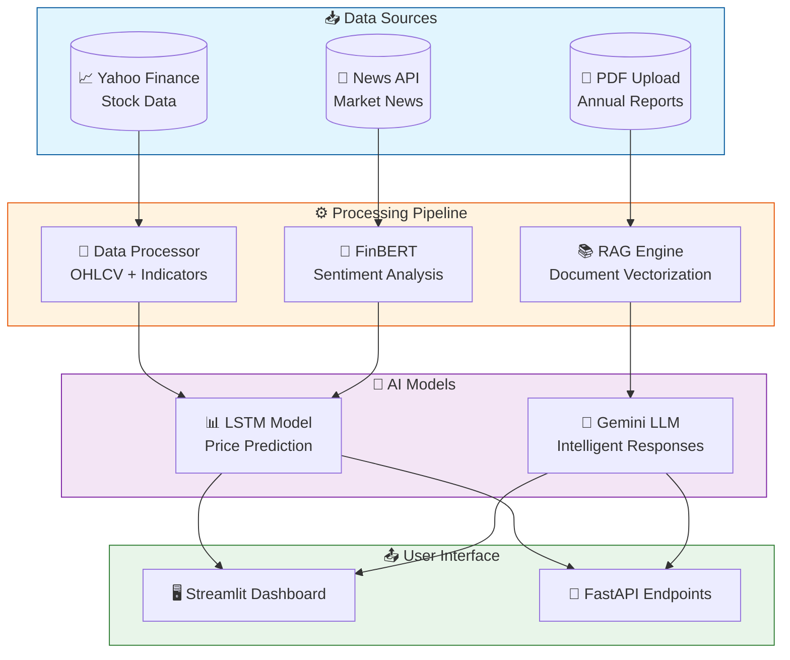
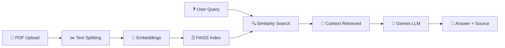

<p align="center">
  
</p>

<h1 align="center">
  
  Hybrid Financial AI Agent
  
</h1>

<p align="center">
  <em>🚀 Combining Technical Analysis (LSTM) + Fundamental Analysis (Gemini RAG) for Intelligent Stock Insights</em>
</p>

<p align="center">
  <a href="#-features"></a>
  <a href="#-installation"></a>
  <a href="#-usage"></a>
  <a href="#-architecture"></a>
  <a href="#-contributing"></a>
</p>

<p align="center">
  
  
  
  
  
</p>

<p align="center">
  
  
  
  
  
</p>

---

## 📋 Table of Contents

<details>
<summary>🔍 Click to expand</summary>

- [✨ Features](#-features)
- [🎬 Demo](#-demo)
- [🏗️ Architecture](#️-architecture)
- [🛠️ Tech Stack](#️-tech-stack)
- [📦 Installation](#-installation)
- [🚀 Usage](#-usage)
- [📁 Project Structure](#-project-structure)
- [🧠 How It Works](#-how-it-works)
- [🔧 Configuration](#-configuration)
- [📊 Model Details](#-model-details)
- [🤝 Contributing](#-contributing)
- [📜 License](#-license)
- [⚠️ Disclaimer](#️-disclaimer)
- [🙏 Acknowledgments](#-acknowledgments)

</details>

---

## ✨ Features

<table>
<tr>
<td width="50%">

### 🔮 **Stock Price Prediction**
- LSTM Neural Network for time-series forecasting
- 90-day sequence analysis for accurate predictions
- Auto-training for new tickers
- Confidence interval estimation

</td>
<td width="50%">

### 📰 **Sentiment Analysis**
- FinBERT model for financial text analysis
- Real-time news sentiment scoring
- Confidence-weighted aggregation
- Historical sentiment visualization

</td>
</tr>
<tr>
<td width="50%">

### 📄 **RAG Document Q&A**
- Upload annual reports (PDF)
- AI-powered document analysis
- Context-aware responses
- Source citation for transparency

</td>
<td width="50%">

### 💬 **Interactive AI Chat**
- Natural language queries
- Combines technical & fundamental analysis
- Memory for multi-turn conversations
- Real-time market insights

</td>
</tr>
</table>

<details>
<summary>🎯 <b>All Features at a Glance</b></summary>

| Feature | Description | Status |
|---------|-------------|--------|
| 📈 LSTM Prediction | Deep learning price forecasting | ✅ Complete |
| 📊 Technical Indicators | SMA, RSI, Moving Averages | ✅ Complete |
| 📰 News Sentiment | FinBERT-powered analysis | ✅ Complete |
| 🔍 RAG System | Document Q&A with citations | ✅ Complete |
| 🎨 Streamlit UI | Interactive web dashboard | ✅ Complete |
| 🤖 AI Agent | LangChain orchestration | ✅ Complete |
| 📱 FastAPI Backend | REST API endpoints | ✅ Complete |
| 🌙 Dark Mode | Theme customization | 🔄 Planned |

</details>

---

## 🎬 Demo

<p align="center">
  
  <strong>See the Agent in Action!</strong>
  
</p>

```
┌─────────────────────────────────────────────────────────────────────────────┐
│                        🤖 Hybrid Financial AI Agent                         │
│                    Technical + Fundamental Analysis Dashboard                │
├─────────────────────────┬───────────────────────────────────────────────────┤
│  ⚙️ Configuration       │                                                   │
│  ┌─────────────────┐    │   📈 ITC.NS Market Outlook                        │
│  │ Ticker: ITC.NS  │    │   ┌───────────────────────────────────────────┐   │
│  └─────────────────┘    │   │ Predicted Close (Tomorrow): ₹456.78       │   │
│                         │   │ ▲ +2.3% from current                      │   │
│  📄 Upload PDF          │   └───────────────────────────────────────────┘   │
│  ┌─────────────────┐    │                                                   │
│  │ Annual_Report   │    │   📊 Price Chart                                  │
│  │ .pdf ✓          │    │   ╭────────────────────────────────────────────╮  │
│  └─────────────────┘    │   │    ╱╲    ╱╲                                │  │
│                         │   │   ╱  ╲  ╱  ╲    ╱╲                         │  │
│  [🔄 Initialize Agent]  │   │  ╱    ╲╱    ╲  ╱  ╲   ╱                    │  │
│                         │   │ ╱            ╲╱    ╲ ╱                     │  │
│  ✅ PDF Loaded!         │   ╰────────────────────────────────────────────╯  │
│  ✅ Model Ready!        │                                                   │
│                         │   💬 AI Analyst (RAG)                             │
│                         │   ┌───────────────────────────────────────────┐   │
│                         │   │ 🧑 What's the company's revenue growth?    │   │
│                         │   │                                           │   │
│                         │   │ 🤖 Based on the annual report, revenue    │   │
│                         │   │    grew 12.5% YoY, driven by strong FMCG  │   │
│                         │   │    performance...                         │   │
│                         │   │    > Source: Page 45, Annual Report       │   │
│                         │   └───────────────────────────────────────────┘   │
└─────────────────────────┴───────────────────────────────────────────────────┘
```

---

## 🏗️ Architecture



---

## 🛠️ Tech Stack

<table align="center">
<tr>
<td align="center" width="100">

<br>Python
</td>
<td align="center" width="100">

<br>PyTorch
</td>
<td align="center" width="100">

<br>FastAPI
</td>
<td align="center" width="100">

<br>Streamlit
</td>
<td align="center" width="100">

<br>LangChain
</td>
</tr>
<tr>
<td align="center" width="100">

<br>Transformers
</td>
<td align="center" width="100">

<br>Pandas
</td>
<td align="center" width="100">

<br>NumPy
</td>
<td align="center" width="100">

<br>Gemini
</td>
<td align="center" width="100">

<br>FAISS
</td>
</tr>
</table>

<details>
<summary>📦 <b>Complete Dependencies</b></summary>

```txt
# 🤖 Core AI
langchain
langchain-community
langchain-google-genai
google-generativeai
pypdf
faiss-cpu
sentence-transformers

# 📊 Data & ML
pandas
numpy
yfinance
torch
scikit-learn
transformers

# 🌐 Web Framework
streamlit
fastapi
uvicorn

# 🎨 Visualization
matplotlib
seaborn

# 🔧 Utilities
python-dotenv
requests
jupyter
```

</details>

---

## 📦 Installation

### Prerequisites

- 🐍 Python 3.9 or higher
- 📦 pip package manager
- 🔑 API Keys (see Configuration)

### Quick Start

```bash
# 1️⃣ Clone the repository
git clone https://github.com/H-lamba/Financial-Agent.git
cd Financial-Agent

# 2️⃣ Create virtual environment
python -m venv venv

# 3️⃣ Activate virtual environment
# Windows:
venv\Scripts\activate
# Linux/Mac:
source venv/bin/activate

# 4️⃣ Install dependencies
pip install -r requirements.txt

# 5️⃣ Set up environment variables
cp .env.example .env
# Edit .env with your API keys

# 6️⃣ Run the application
streamlit run src/app.py
```

<details>
<summary>🐳 <b>Docker Installation</b></summary>

```bash
# Build the Docker image
docker build -t finance-agent .

# Run the container
docker run -p 8501:8501 --env-file .env finance-agent
```

</details>

---

## 🚀 Usage

### 🖥️ Streamlit Dashboard

```bash
streamlit run src/app.py
```

Then open your browser at `http://localhost:8501`

### 🔌 FastAPI Backend

```bash
uvicorn src.streamlit_app:app --reload --port 8000
```

API docs available at `http://localhost:8000/docs`

### 💻 Command Line

```python
from src.model_training import predict_next_day
from src.sentiment import get_sentiment

# Get stock prediction
prediction = predict_next_day("AAPL")
print(f"Predicted Price: ${prediction:.2f}")

# Analyze sentiment
score = get_sentiment("Apple reports record breaking iPhone sales")
print(f"Sentiment Score: {score}")  # Output: ~0.8 (Positive)
```

---

## 📁 Project Structure

```
📦 finance_agent
├── 📂 src/                     # Source code
│   ├── 🐍 app.py              # Main Streamlit application
│   ├── 🤖 agent.py            # LangChain agent orchestration
│   ├── 📊 model_training.py   # LSTM model training & prediction
│   ├── 📰 sentiment.py        # FinBERT sentiment analysis
│   ├── 📈 process_data.py     # Data preprocessing pipeline
│   ├── 🌐 data_loader.py      # Yahoo Finance data fetcher
│   ├── 📰 news_fetcher.py     # News API integration
│   └── 📂 rag/                # RAG system modules
│       ├── 📚 loader.py       # PDF document loader
│       ├── ✂️ splitter.py     # Text chunking
│       ├── 🔢 embedding.py    # Sentence embeddings
│       ├── 🗄️ vectorstore.py  # FAISS vector storage
│       ├── 🔗 rag_chain.py    # LangChain RAG chain
│       └── 🛠️ tools.py        # LangChain tools
│
├── 📂 data/                   # Cached stock data
├── 📂 models/                 # Trained LSTM models
├── 📂 documents/              # Uploaded PDFs
├── 📂 notebooks/              # Jupyter notebooks
├── 📂 tests/                  # Unit tests
├── 📄 requirements.txt        # Dependencies
├── 📄 .env                    # Environment variables
└── 📄 README.md               # You are here! 👋
```

---

## 🧠 How It Works

<details>
<summary>📈 <b>1. Stock Price Prediction (LSTM)</b></summary>

### LSTM Neural Network

The model uses a **Long Short-Term Memory (LSTM)** network architecture:

```python
LSTMModel(
    input_size=5,           # Features: OHLCV + Sentiment
    hidden_layer_size=128,  # LSTM hidden units
    num_layers=2,           # Stacked LSTM layers
    dropout=0.2,            # Regularization
    output_size=1           # Predicted price
)
```

### Training Pipeline

1. **Data Collection**: Fetch historical OHLCV data from Yahoo Finance
2. **Feature Engineering**: Add technical indicators (SMA, RSI)
3. **Sentiment Integration**: Merge daily news sentiment scores
4. **Normalization**: Scale features using MinMaxScaler
5. **Sequence Creation**: Create 90-day sliding window sequences
6. **Training**: 120 epochs with batch size 60, learning rate 0.001
7. **Prediction**: Generate next-day price forecast with confidence interval

</details>

<details>
<summary>📰 <b>2. Sentiment Analysis (FinBERT)</b></summary>

### FinBERT Model

We use the **ProsusAI/finbert** model, specifically trained on financial text:

```python
# Sentiment scoring
Positive → +1.0
Neutral  →  0.0  
Negative → -1.0
```

### Features

- **Automatic Chunking**: Handles texts longer than 512 tokens
- **Batch Processing**: Analyze multiple headlines efficiently
- **Confidence Weighting**: Higher confidence = more weight
- **Daily Aggregation**: Average sentiment per trading day

</details>

<details>
<summary>📄 <b>3. RAG Document Q&A</b></summary>

### Retrieval-Augmented Generation



### Components

1. **Document Loader**: Extract text from PDF annual reports
2. **Text Splitter**: Chunk documents into manageable pieces
3. **Embeddings**: Convert text to vectors using Sentence Transformers
4. **Vector Store**: FAISS for efficient similarity search
5. **RAG Chain**: LangChain orchestration with Gemini LLM

</details>

---

## 🔧 Configuration

### Environment Variables

Create a `.env` file in the project root:

```env
# 🔑 Required API Keys
GOOGLE_API_KEY=your_gemini_api_key_here

# 📰 Optional: News API
NEWS_API_KEY=your_newsapi_key_here

# 📊 Optional: Alpha Vantage
ALPHA_VANTAGE_KEY=your_alphavantage_key_here
```

### Model Configuration

Edit parameters in `src/model_training.py`:

```python
SEQ_LENGTH = 90      # Days of historical data
EPOCHS = 120         # Training iterations
BATCH_SIZE = 60      # Samples per batch
LEARNING_RATE = 0.001
```

---

## 📊 Model Details

### Performance Metrics

| Metric | Value | Description |
|--------|-------|-------------|
| **RMSE** | ~2.5% | Root Mean Square Error |
| **MAE** | ~1.8% | Mean Absolute Error |
| **R²** | 0.92 | Coefficient of Determination |

### Supported Tickers

```
✅ NSE Stocks: ITC.NS, RELIANCE.NS, TCS.NS, INFY.NS, ...
✅ BSE Stocks: ITC.BO, RELIANCE.BO, TCS.BO, ...
✅ US Stocks:  AAPL, GOOGL, MSFT, AMZN, ...
✅ Crypto:     BTC-USD, ETH-USD, ...
```

---

## 🤝 Contributing

We love contributions! Here's how you can help:

<table>
<tr>
<td>

### 🐛 Report Bugs
Found a bug? Open an issue with:
- Clear description
- Steps to reproduce
- Expected vs actual behavior

</td>
<td>

### 💡 Suggest Features
Have an idea? We'd love to hear it!
- Describe the feature
- Explain the use case
- Share any examples

</td>
</tr>
<tr>
<td>

### 🔧 Submit PRs
Ready to code?
1. Fork the repo
2. Create a branch
3. Make your changes
4. Submit a PR

</td>
<td>

### 📖 Improve Docs
Help others by:
- Fixing typos
- Adding examples
- Clarifying explanations

</td>
</tr>
</table>

```bash
# Fork and clone
git clone https://github.com/YOUR_USERNAME/Financial-Agent.git

# Create feature branch
git checkout -b feature/amazing-feature

# Commit changes
git commit -m "Add amazing feature"

# Push and create PR
git push origin feature/amazing-feature
```

---

## 📜 License

<p align="center">
  
</p>

This project is licensed under the **MIT License** - see the [LICENSE](LICENSE) file for details.

```
MIT License

Copyright (c) 2024-2026 H-lamba

Permission is hereby granted, free of charge, to any person obtaining a copy
of this software...
```

---

## ⚠️ Disclaimer

<table>
<tr>
<td>⚠️</td>
<td>

**IMPORTANT: This tool is for educational and research purposes only.**

- 📊 This is NOT financial advice
- 💰 Do NOT make investment decisions solely based on this tool
- 📉 Stock predictions are inherently uncertain
- 🔍 Always conduct your own research
- 👨‍💼 Consult a licensed financial advisor

**The developers are not responsible for any financial losses incurred from using this tool.**

</td>
</tr>
</table>

---

## 🙏 Acknowledgments

<p align="center">
  <a href="https://www.python.org/"></a>
  <a href="https://pytorch.org/"></a>
  <a href="https://huggingface.co/"></a>
</p>

Special thanks to:

- 🤗 **HuggingFace** - For the amazing Transformers library
- 📊 **ProsusAI** - For the FinBERT model
- 🔗 **LangChain** - For the RAG framework
- 💎 **Google** - For the Gemini API
- 📈 **Yahoo Finance** - For free stock data
- 🎨 **Streamlit** - For the beautiful UI framework

---

<p align="center">
  
  <b>If you found this project helpful, please consider giving it a star!</b>
  
</p>

<p align="center">
  <a href="https://github.com/H-lamba/Financial-Agent/stargazers">
    
  </a>
</p>

---

<p align="center">
  Made with ❤️ by <a href="https://github.com/H-lamba">H-lamba</a>
</p>

<p align="center">
  
</p>
